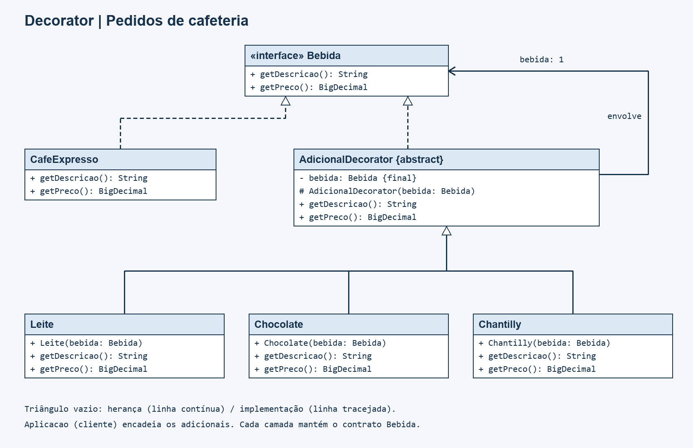

# Padrão Decorator

Projeto desenvolvido para demonstrar a utilização do padrão de projeto **Decorator** em Java.

## 📌 Sobre o projeto

O projeto simula um sistema de **pedidos de uma cafeteria**, permitindo personalizar uma bebida com diferentes adicionais.

O padrão Decorator é utilizado para acrescentar descrição e preço a uma bebida por meio de objetos que a envolvem, permitindo combinar adicionais sem criar uma classe específica para cada combinação.

Neste projeto, a bebida base é o **Café Expresso**, e os adicionais disponíveis são:

- **Leite**
- **Chocolate**
- **Chantilly**

Os adicionais podem ser combinados e repetidos. A descrição e o preço total são calculados a partir da composição escolhida e exibidos no console pela aplicação.

## 🧩 Padrão Decorator

O **Decorator** é um padrão de projeto estrutural que permite adicionar responsabilidades a um objeto por composição, envolvendo-o em outros objetos que seguem o mesmo contrato.

Neste projeto, a interface `Bebida` define as operações para consultar a descrição e o preço. A classe `CafeExpresso` representa a bebida base.

A classe abstrata `AdicionalDecorator` também implementa `Bebida` e mantém uma referência a outra bebida. As classes `Leite`, `Chocolate` e `Chantilly` estendem esse decorador, acrescentando sua descrição e seu valor ao resultado do objeto envolvido.

Dessa forma, uma bebida com todos os adicionais pode ser representada por:

```text
Chantilly
└── Chocolate
    └── Leite
        └── CafeExpresso
```

Essa composição é criada da seguinte maneira:

```java
Bebida bebida = new Chantilly(new Chocolate(new Leite(new CafeExpresso())));
```

Como todos os objetos seguem a interface `Bebida`, um decorador pode envolver tanto a bebida base quanto outro decorador. Assim, não é necessário criar classes como `CafeComLeite` ou `CafeComLeiteEChocolate`.

## 📁 Estrutura do projeto

```text
Padr-o-Decorator/
│
├── docs/
│   └── diagrama-classes.png
│
├── src/
│   ├── main/
│   │   └── java/
│   │       └── padroesestruturais/
│   │           └── decorator/
│   │               ├── AdicionalDecorator.java
│   │               ├── Aplicacao.java
│   │               ├── Bebida.java
│   │               ├── CafeExpresso.java
│   │               ├── Chantilly.java
│   │               ├── Chocolate.java
│   │               └── Leite.java
│   │
│   └── test/
│       └── java/
│           └── padroesestruturais/
│               └── decorator/
│                   └── BebidaTest.java
│
├── .gitignore
├── pom.xml
└── README.md
```

## ⚙️ Funcionamento

A interface `Bebida` define os métodos que a bebida base e os decoradores devem implementar:

```java
String getDescricao();
BigDecimal getPreco();
```

A classe `CafeExpresso` retorna a descrição `Café expresso` e o preço inicial de **R$ 5,00**.

A classe abstrata `AdicionalDecorator` recebe uma `Bebida` no construtor e delega a ela as consultas de descrição e preço. Suas subclasses complementam esses resultados:

| Adicional | Texto acrescentado à descrição | Valor acrescentado |
| --- | --- | --- |
| `Leite` | `, leite` | R$ 1,50 |
| `Chocolate` | `, chocolate` | R$ 2,00 |
| `Chantilly` | `, chantilly` | R$ 2,50 |

Os valores são representados por `BigDecimal`, e cada decorador utiliza `add()` para somar seu preço ao da bebida envolvida.

Por exemplo, um café com leite e chocolate é criado assim:

```java
Bebida bebida = new Chocolate(new Leite(new CafeExpresso()));

System.out.println(bebida.getDescricao()); // Café expresso, leite, chocolate
System.out.println(bebida.getPreco());     // 8.50
```

A implementação também apresenta os seguintes comportamentos:

- Um mesmo adicional pode ser aplicado mais de uma vez, acrescentando uma nova porção à descrição e ao preço.
- A descrição segue a ordem dos adicionais, da camada mais interna para a mais externa.
- Alterar a ordem dos mesmos adicionais altera a descrição, mas mantém o preço total.
- Criar uma bebida decorada não modifica a bebida original, permitindo reutilizá-la em diferentes pedidos.
- Os decoradores aceitam qualquer implementação de `Bebida`.
- Uma bebida nula é rejeitada no construtor com `NullPointerException` e a mensagem `A bebida é obrigatória`.

A classe `Aplicacao` demonstra o funcionamento criando um café expresso com leite, chocolate e chantilly. O preço total é formatado em reais com `NumberFormat` e a localidade `pt_BR`.

### Executando a aplicação

Com o **JDK 11 ou superior** e o **Maven** instalados, execute na pasta do projeto:

```bash
mvn compile
java -cp target/classes padroesestruturais.decorator.Aplicacao
```

Saída esperada:

```text
Café expresso, leite, chocolate, chantilly
Total: R$ 11,00
```

## 🏗️ Estrutura do Decorator

Os elementos do padrão utilizados no projeto podem ser identificados da seguinte forma:

| Elemento do Decorator | Implementação |
| --- | --- |
| Component | `Bebida` |
| Concrete Component | `CafeExpresso` |
| Decorator | `AdicionalDecorator` |
| Concrete Decorator | `Leite` |
| Concrete Decorator | `Chocolate` |
| Concrete Decorator | `Chantilly` |
| Client | `Aplicacao` |

Essa organização permite acrescentar funcionalidades à bebida sem alterar a classe `CafeExpresso`. A referência de `AdicionalDecorator` para `Bebida` permite encadear diferentes adicionais e tratar o resultado pelo mesmo contrato da bebida base.

## 🧪 Testes

O projeto possui testes automatizados utilizando **JUnit 5**.

Os 15 testes da classe `BebidaTest` verificam:

- A descrição e o preço do café expresso sem adicionais.
- A aplicação individual de leite, chocolate e chantilly.
- As três combinações de dois adicionais distintos.
- A combinação dos três adicionais em uma mesma bebida.
- A utilização de porções repetidas de um adicional.
- A ordem dos adicionais na descrição e a manutenção do preço ao inverter essa ordem.
- A preservação da bebida original ao criar diferentes pedidos.
- A rejeição de bebida nula em cada um dos três decoradores.
- A aplicação de um decorador a outra implementação de `Bebida`, utilizando um chá definido no próprio teste.

Para executar os testes utilizando Maven:

```bash
mvn test
```

## 📊 Diagrama de Classes

O diagrama de classes do projeto está disponível na pasta `docs`.



O diagrama apresenta a estrutura das bebidas e dos adicionais utilizados na implementação do padrão Decorator.

## 🛠️ Tecnologias utilizadas

- Java 11
- Maven
- JUnit 5
- Padrões de Projeto — Decorator

## 🎯 Objetivo

O objetivo deste projeto é demonstrar de forma prática a aplicação do padrão **Decorator**, permitindo personalizar bebidas por meio da combinação de adicionais.

Com essa abordagem, novos adicionais podem ser criados através de subclasses de `AdicionalDecorator`, enquanto novas bebidas base podem implementar a interface `Bebida`. As combinações são construídas por composição, evitando uma classe específica para cada variação de pedido.

## 👨‍💻 Autor

**Felipe Baba**

Projeto desenvolvido para fins acadêmicos, como aplicação prática do padrão de projeto **Decorator**.
